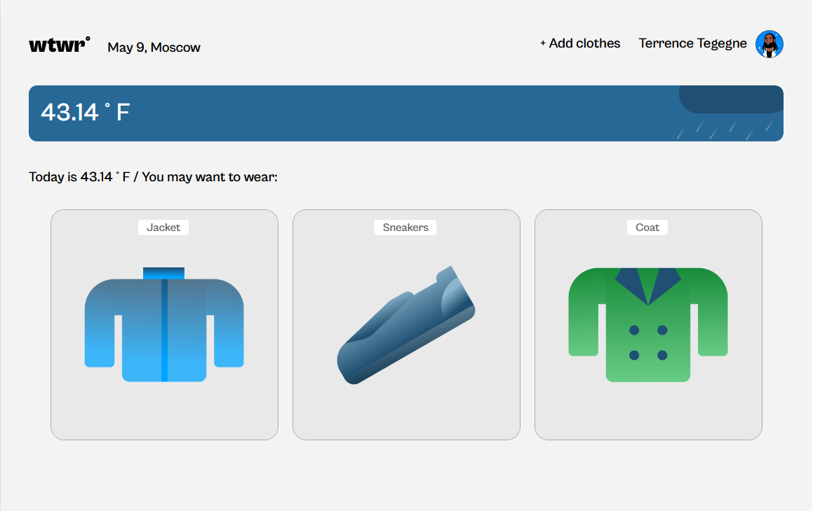
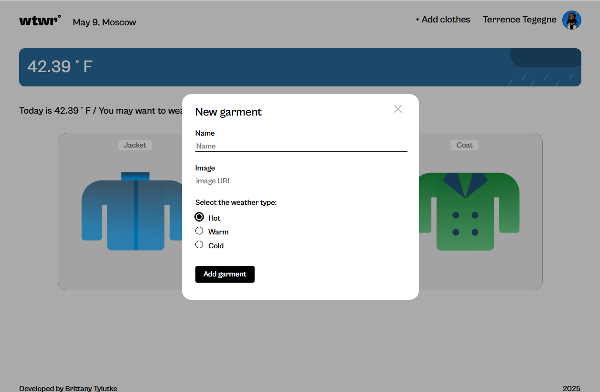
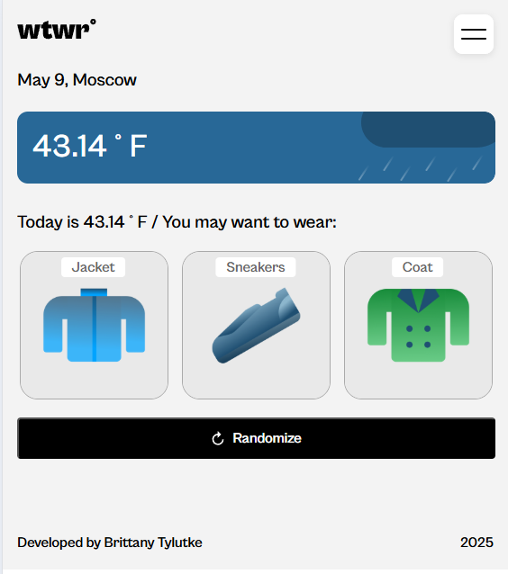
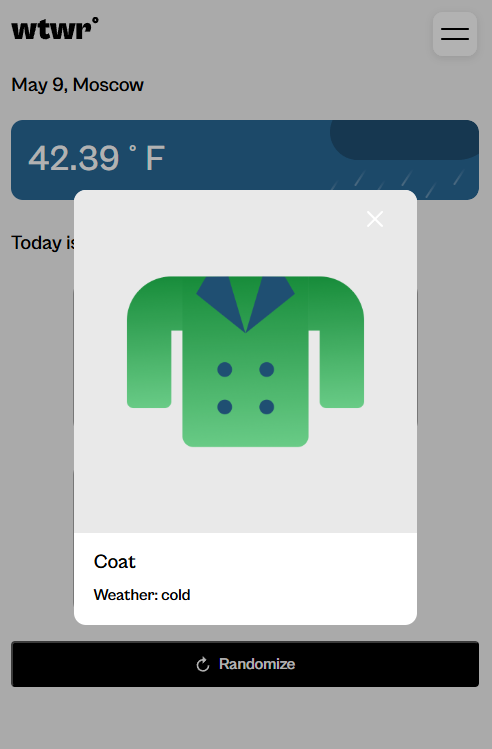

# Project 10: Climatrix 

**Description:**
Climatrix is a simple, cross-platform weather app that dynamically displays the current weather using live API data. Built with React and JavaScript, and styled with CSS, Climatrix provides real-time, location-based weather updates, complete with fun visuals, a smooth user interface, and accurate time-of-day adaptation.

## Project Features
- Live Weather Updates – Uses an API to fetch current weather conditions 
- Time-of-Day Adaptation – Dynamically adjusts visuals based on day or night 
- Cross-Platform Responsiveness – Optimized for desktop and mobile 
- Popup Modal – Interactive modals for additional details 
- Dynamic Weather Images – Fun icons based on real-time conditions
- Flat BEM file structure

## Technologies Used
- React – For building the dynamic UI 
- JavaScript (ES6) – Handles logic and API interactions
- CSS – Ensures a smooth and responsive design
- Weather API – Provides real-time forecasts
Modals & Animations – Improve user experience

## Installation & Usage
1. Clone the Repository
2. Install Dependencies
3. Start the Development Server
Now you can use Climatrix to check the weather!

**Images**

